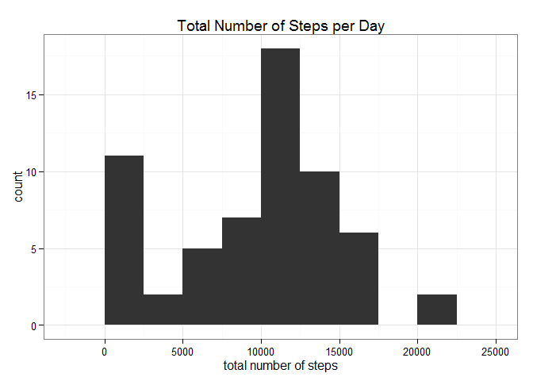
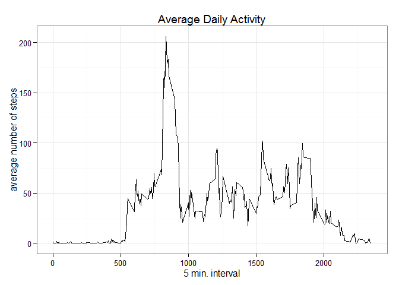
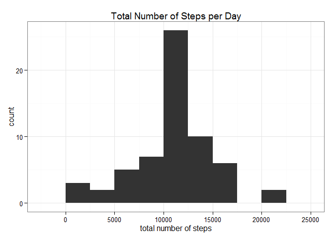
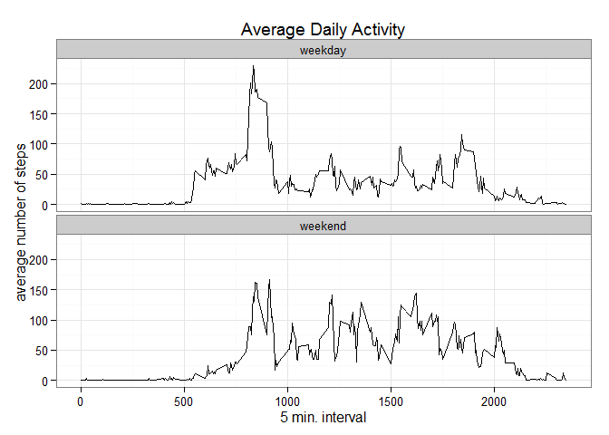

# Reproducible Research: Peer Assessment 1

For an introduction to the topic and the data, please refer to the README document in this folder.


## Loading and preprocessing the data

The data is provided in zipped form in this folder, and can be extracted using the last few lines of code below.


```r
# Load libraries
library(plyr)
library(ggplot2)
library(Hmisc)

# Unzip and load data
tmp <- unzip("activity.zip")
data <- read.csv(tmp)
unlink(tmp)

summary(data)
```

```
##      steps                date          interval     
##  Min.   :  0.00   2012-10-01:  288   Min.   :   0.0  
##  1st Qu.:  0.00   2012-10-02:  288   1st Qu.: 588.8  
##  Median :  0.00   2012-10-03:  288   Median :1177.5  
##  Mean   : 37.38   2012-10-04:  288   Mean   :1177.5  
##  3rd Qu.: 12.00   2012-10-05:  288   3rd Qu.:1766.2  
##  Max.   :806.00   2012-10-06:  288   Max.   :2355.0  
##  NA's   :2304     (Other)   :15840
```

For a later question, we need to know which days are weekdays and which are weekends. To do this, we have to convert the `date` column into a real date format and add the names of the days in an additional column.


```r
# Convert date to format that R understands
data$date <- strptime(data$date, format="%Y-%m-%d")

# Add weekday information
data$day <- weekdays(data$date, abbreviate=TRUE)

summary(data)
```

```
##      steps             date                        interval     
##  Min.   :  0.00   Min.   :2012-10-01 00:00:00   Min.   :   0.0  
##  1st Qu.:  0.00   1st Qu.:2012-10-16 00:00:00   1st Qu.: 588.8  
##  Median :  0.00   Median :2012-10-31 00:00:00   Median :1177.5  
##  Mean   : 37.38   Mean   :2012-10-30 23:32:27   Mean   :1177.5  
##  3rd Qu.: 12.00   3rd Qu.:2012-11-15 00:00:00   3rd Qu.:1766.2  
##  Max.   :806.00   Max.   :2012-11-30 00:00:00   Max.   :2355.0  
##  NA's   :2304                                                   
##      day           
##  Length:17568      
##  Class :character  
##  Mode  :character  
##                    
##                    
##                    
## 
```

Now the `data.frame` has four columns:

* the first contains numerical and missing values (NAs) for the steps taken,
* the second contains the date in an adequate format,
* the third contains the measurement intervals,
* and the fourth contains the day's names as characters.


## What is the mean total number of steps taken per day?

The first thing to ask about data from personal activity monitoring with a pedometer is: how many steps did the person take per day, on average?
To answer this question, we can have a look at the distribution of total steps per day over the days we have in the data set.


```r
# Calculate total steps per day, ignoring NAs
total_PD <- ddply(data, .(date), function(x) sum(x$steps, na.rm=TRUE))
colnames(total_PD) <- c("date", "total_steps")
```


```r
# Plot a histogram of the results
ggplot(total_PD, aes(x=total_steps)) +
  geom_histogram(binwidth=2500) +
  labs(title="Total Number of Steps per Day", x="total number of steps") +
  theme_bw()
```

 

The histogram above shows that, on most days, between 10,000 and 12,500 steps were taken per day. To figure out the exact average of steps per day, we can have a look at the summary statistics for the `total_PD` data, or calculate the mean and median directly.


```r
summary(total_PD)

mean_PD <- mean(total_PD$total_steps, na.rm=TRUE)
median_PD <- median(total_PD$total_steps, na.rm=TRUE)
```

```
##       date                      total_steps   
##  Min.   :2012-10-01 00:00:00   Min.   :    0  
##  1st Qu.:2012-10-16 00:00:00   1st Qu.: 6778  
##  Median :2012-10-31 00:00:00   Median :10395  
##  Mean   :2012-10-30 23:32:27   Mean   : 9354  
##  3rd Qu.:2012-11-15 00:00:00   3rd Qu.:12811  
##  Max.   :2012-11-30 00:00:00   Max.   :21194
```

In plain text: the mean number of steps taken per day is 9,354.23, while the median is 10,395.

## What is the average daily activity pattern?

Now that we know that the person whose data we are analysing took around 9,354.23 steps per day, we would also like to know how these steps were distributed over an average day. To analyse this, we're calculating the mean number of steps for each five-minute interval measured, across all days.


```r
# Calculate average steps per interval
total_TS <- ddply(data, .(interval), function(x) mean(x$steps, na.rm=TRUE))
colnames(total_TS) <- c("interval", "mean_steps")
```

These data can be plotted as a time series / in a line plot, to show the step average in each interval.


```r
# Plot the results
ggplot(total_TS, aes(x=interval, y=mean_steps)) +
  geom_line() +
  labs(title="Average Daily Activity", x="5 min. interval", y="average number of steps") +
  theme_bw()
```

 

It looks like our subject usually gets up at around six in the morning, and is most active some time after that and before ten. The highest average number of steps in a five-minute interval is a bit more than 200. What is it, exactly, and in which interval does it occur?


```r
# Find interval with most average steps
total_TS[total_TS$mean_steps == max(total_TS$mean_steps),]
```

```
##     interval mean_steps
## 104      835   206.1698
```

The interval with the most steps (as a daily average) is that between 8:35 and 8:40 a.m., and the average number of steps there is 206.1698.

## Imputing missing values

We have seen in the preprocessing that there are values missing (NA) in the `steps` column, which we have excluded in the analysis steps done so far. Now we want to replace these NAs with real values to be able to include them in the analysis. The easiest way to do this - to impute these missing values - is using some kind of average as replacement. Since we have seen that there is great variability in the number of steps taken across an average day, I would rather use the means of the five-minute intervals to replace the respective NAs, instead of daily averages, which would introduce a high number of steps also in the middle of the night.


```r
# Split the data by intervals, creating a list of dataframes (one per interval)
split_data <- split(data, data$interval)

# Write a function that replaces NAs with the mean of that data subset
NA_to_mean <- function(x) {
  x$steps[is.na(x$steps)] <- mean(x$steps, na.rm=TRUE)
  return(x)
}

# Use the above function on all the dataframes in the split_data list
imp_list <- lapply(split_data, function(x) NA_to_mean(x))

# Convert back to a single dataframe and remove the additional rownames
imputed <- do.call("rbind", imp_list)
row.names(imputed) <- NULL
```

How does this imputation change the overall mean and median?


```r
# Calculate total steps per day
total_PD_imp <- ddply(imputed, .(date), function(x) sum(x$steps))
colnames(total_PD_imp) <- c("date", "total_steps")
```


```r
# Plot a histogram of the results
ggplot(total_PD_imp, aes(x=total_steps)) +
  geom_histogram(binwidth=2500) +
  labs(title="Total Number of Steps per Day", x="total number of steps") +
  theme_bw()
```

 

The histogram looks almost exactly like the one we've seen before, except that the number of times none or few steps were taken was greatly reduced.


```r
summary(total_PD_imp)

mean_imp <- mean(total_PD_imp$total_steps)
median_imp <- median(total_PD_imp$total_steps)
```

```
##       date                      total_steps   
##  Min.   :2012-10-01 00:00:00   Min.   :   41  
##  1st Qu.:2012-10-16 00:00:00   1st Qu.: 9819  
##  Median :2012-10-31 00:00:00   Median :10766  
##  Mean   :2012-10-30 23:32:27   Mean   :10766  
##  3rd Qu.:2012-11-15 00:00:00   3rd Qu.:12811  
##  Max.   :2012-11-30 00:00:00   Max.   :21194
```

For the mean and media, though, the imputation of missing values brought along big changes. While the old mean was 9,354.23, it is now 10,766.19. The median changed from 10,395 to 10,766.19. The imputation of the missing values therefore helped to assimilate the mean and the median.

## Are there differences in activity patterns between weekdays and weekends?

Since we replaced the NAs with the means for the five-minute intervals, the average daily activity pattern (using the means for the five-minute intervals) has not changed. Another interesting aspect, though, would be to look for changes in weekdays and weekends (I know I mostly walk less on weekends). This is where the names of the days we added to the data in the preprocessing come in.


```r
# Create vectors with the day's names
weekdays <- c("Mon", "Tue", "Wed", "Thu", "Fri")
weekends <- c("Sat", "Sun")

# Write a fuction that tests if a given day is a weekday or on the weekend
# Return the result as a factor
test_day <- function(x) {
  if(x %in% weekdays) {
    return(as.factor("weekday"))
  }
  else {
    return(as.factor("weekend"))
  }
}

# Apply the above function to all the days in the data set with the imputed values
# Add the results directly as a new column to the dataframe
imputed$week <- sapply(imputed$day, function(x) test_day(x))

# Calculate the mean number of steps per interval for weekdays and weekends
total_TS_week <- ddply(imputed, .(interval, week), function(x) mean(x$steps))
colnames(total_TS_week) <- c("interval", "week", "mean_steps")
```

These data can again be plotted as a time series / in a line plot, to show the step average in each interval for weekdays and weekends separately.


```r
# Plot the results
ggplot(total_TS_week, aes(x=interval, y=mean_steps)) +
  geom_line() +
  facet_wrap(~week, nrow=2) +
  labs(title="Average Daily Activity", x="5 min. interval", y="average number of steps") +
  theme_bw()
```

 

We can see that the subject gets up later on the weekend than on weekdays, and the peak after 8:35 a.m. is not as pronounced. Over the rest of the average day, the subject is walking more on weekends than on weekdays (a desk job, maybe?). Can we confirm this with a simple sum of the average steps?


```r
# Calculate the sum of the average steps for weekdays and weekends
total_TSW_sum <- ddply(total_TS_week, .(week), function(x) sum(x$mean_steps))
```

Indeed, the sum of average steps per day on a weekday is 10,255.85, while on the weekend our subject typically takes around 12,201.52 steps a day.
